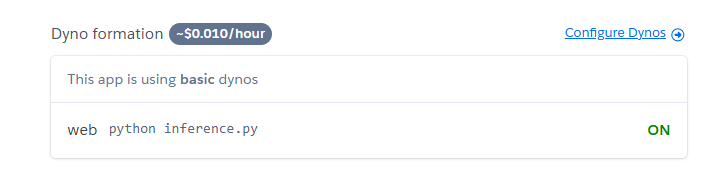

# 📊 API de Regressão Linear com Flask, Docker e Heroku

Este projeto implementa uma **API Flask** para fazer previsões usando um modelo de **regressão linear**.  
A API recebe dados via requisições HTTP **POST**, processa as entradas e retorna a predição do modelo treinado.
A aplicação é armazenada e hosteada com auxílio do site Heroku para que se possa fazer requisições de qualquer computador com acesso a internet.

---

## 🚀 **Links**
- **GitHub:** [arthur-ym/regressao_linear_heroku](https://github.com/arthur-ym/regressao_linear_heroku)  
- **Host da Aplicação** [host](https://test-aym-dev-be5a9d8cc90f.herokuapp.com/predict) 

---

## 📂 **Estrutura do Projeto**
📁 `regressao-linear/`  
├── 📄 `inference.py` → Código principal da API Flask, faz a inferencia do modelo  
├── 📄 `model.py` → Script para treinar e salvar o modelo, modelo simples para simplificar a requisição.

├── 📄 `test_api.py` → Script para testar a API fazendo requisições HTTP, é necessário que o app esteja online para aceitar a requisição.

├── 📄 `requirements.txt` → Lista de bibliotecas necessárias para rodar o projeto.  
├── 📄 `Dockerfile` → Configuração para construir a imagem Docker da API.  
└── 📄 `README.md` → Documentação do projeto.  
└── 📄 `Procfile` → O Procfile define os comandos para iniciar o app na plataforma Heroku

web: gunicorn app:app
Significa:
"Usamos o Gunicorn para rodar a aplicação Flask (app) do arquivo app.py como um servidor web."

Para hostear o app na plataforma é necessário rodar:

heroku container:login

docker build -t registry.heroku.com/test-aym-dev/web .

docker push registry.heroku.com/test-aym-dev/web

heroku container:release web --app test-aym-dev

com "test-aym-dev" sendo o nome do app criado, para reproduzir, basta mudar para um nome de seu app.

No momento minha aplicação esta offline para nao gerar custos.

## **Descrição do Serviço**

### Serviço: Previsão de Regressão Linear
Endpoint: /predict
Método HTTP: POST

Descrição do Serviço:
Este serviço recebe dados de entrada (valores numéricos) através de uma requisição HTTP POST, executa uma previsão utilizando um modelo de regressão linear previamente treinado e retorna o resultado dessa previsão.

Parâmetros de Entrada:
A entrada é esperada no formato JSON e deve conter um array com os valores numéricos sobre os quais a previsão será feita.

Formato esperado: Um objeto JSON com o campo "X", que deve ser um array de números (pode ser de tamanho variável, dependendo da aplicação).

Exemplo de requisição de entrada (JSON):
json
{
  "X": [2, 5, 10]
}
O campo X contém uma lista de valores numéricos para os quais a previsão será feita. Nesse exemplo, o modelo fará uma previsão para três valores: 2, 5 e 10.

Parâmetros de Saída:
A resposta do serviço será retornada no formato JSON. O campo prediction conterá a previsão realizada pelo modelo de regressão linear para os valores de entrada.
Formato esperado: Um objeto JSON contendo um campo "prediction", que será um array de números (resultados das previsões).

Exemplo de resposta de saída (JSON):
json

{
  "prediction": [10.1, 25.3, 50.4]
}

**Fluxo do Serviço**:

O cliente faz uma requisição HTTP POST para o endpoint /predict com os dados de entrada no formato JSON.

O Flask recebe esses dados e os passa para o modelo de regressão linear para calcular as previsões.

O Flask retorna uma resposta com os resultados das previsões, que são enviados de volta ao cliente no formato JSON.
